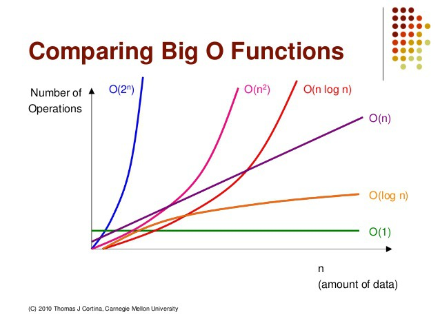

# Algorithms

알고리즘은 특정 문제를 해결하거나 계산을 수행하기 위한 명확하고 단계적인 명령어의 집합이다.\
수학적으로 알고리즘은 입력 집합에서 출력 집합으로의 함수로 표현될 수 있다.

## 핵심 요소
- 명확성 (Definiteness): 각 단계의 명령어는 명확하고 모호하지 않아야 한다.
- 입력 (Input): 알고리즘은 하나 이상의 입력을 받는다.
- 출력 (Output): 실행 결과로 최소 하나의 출력을 반환한다.
- 유한성 (Finiteness): 알고리즘은 유한한 수의 단계를 거쳐 반드시 종료된다.
- 효율성 (Efficiency): 알고리즘의 실행 시간과 공간 사용량은 최소화되어야 한다.

## 시간 복잡도
알고리즘이란 어떤 목적을 달성하거나 결과물을 만들어내기 위해 거쳐야하는 일련의 과정을 의미한다.\
해결하는 루트는 다양하며 여러가지 상황에 따른 알고리즘은 모두 다르다.\
 따라서 시간 복잡도가 가낭 낮은 알고리즘을 선택하여 사용한다.

여기서 알고리즘의 실행시간은 컴퓨터가 알고리즘 코드를 실행하는 속도에 의존한다.\
이 속도는 컴퓨터의 처리속도, 사용된 언어 종류, 컴파일러의 속도에 달려있다.

알고리즘의 실행시간을 두 부분으로 나누면

1. 입력값의 크기에 따라 알고리즘의 실행시간을 검증해볼 수 있다.
2. 입력값의 크기에 따른 함수의 증가량, 우리는 이것을 성장률 이라고 부른다.\
이때 중요하지 않는 상수와 계수들을 제거하면 알고리즘의 실행시간에서\
중요한 성장률에 집중할 수 있는데 이것을 점근적 표기법(Asymptotic notation)이라 부른다.\
여기서, 점근적이라는 의미는 가장 큰 영향을 주는 항만 계산한다는 의미다.

점근적 표기법은 다음 세가지가 있는데 시간복잡도를 나타내는데 사용된다.

- 최상의 경우: 오메가 표기법 (Big-Ω Notation)
- 평균의 경우: 세타 표기법 (Big-Θ Notation)
- 최악의 경우: 빅오 표기법 (Big-O Notation)

평균인 세타 표기를 하면 가장 정확하고 좋겠지만 평가하기가 까다롭다.\
그래서 최악의 경우인 빅오를 사용하는데 알고리즘이 최악일때의 경우를 판단하면 평균과 가까운 성능으로 예측하기 쉽기 때문이다.

### 빅오 표기법 (Big-O)

빅오 표기법은 불필요한 연산을 제거하여 알고리즘 분석을 쉽게 할 목적으로 사용된다.

Big-O로 측정되는 복잡성에는 시간과 공간 복잡도가 있는데
- 시간복잡도는 입력된 N의 크기에 따라 실행되는 조작의 수를 나타낸다.
- 공간복잡도는 알고리즘이 실행될때 사용하는 메모리의 야을 나타낸다.\
요즘에는 데이터를 저장할 수 있는 메모리의 발전으로 중요도가 낮아졌다.
- 아래는 대표적인 Big-O의 복잡도를 나타내는 표이다.



### 시간 복잡도

시간 복잡도의 가장 간단한 정의는 알고리즘의 성능을 설명하는 것이다.\
다른 의미로는 알고리즘을 수행하기 위해 프로세스가 수행해야하는 연산을 수치화 한 것이다.\
왜 실행시간이 아닌 연산 수치로 판별할까? 라는 답은 위에도 설명했지만 \
명령어의 실행 시간은 컴퓨터의 하드웨어 또는 프로그래밍 언어에 따라 편차가 크게 달라지기 때문에 명령어의 실행 횟수만을 고려하는 것이다.

시간복잡도에서 중요하게 보는것은 가장 큰 영향을 미치는 N의 단위이다.

```
1		O(1)	--> 상수
2N + 20 O(N)	--> N이 가장 큰 영향을 미친다.
3N^2	O(N^2)	--> N^2이 가장 큰 영향을 미친다.
```

시간 복잡도의 문제해결 단계를 나열 하면 아래와 같다.

```
O(1)		- 상수 시간		: 문제를 해결하는데 오직 한 단계만 처리함.
O(log N)	- 로그 시간		: 문제를 해결하는데 필요한 단계들이 연산마다 특정 요인에 의해 줄어듬.
O(N)		- 직선적 시간	: 문제를 해결하기 위한 단계의 수와 입력값 N이 1:1 관계를 가짐.
O(N log N)	- 선형 로그형	: 문제를 해결하기 위한 단계의 수가 N*(log2N) 번 만큼의 수행시간을 가진다.
O(N^2)		- 2차 시간		: 문제를 해결하기 위한 단계의 수는 입력값 N의 제곱.
O(C^N)		- 지수 시간		: 문제를 해결하기 위한 단계의 수는 주어진 상수값 C 의 N 제곱.
```

아래표는 실행시간이 빠른 순으로 입력 N 값에 따른 서로 다른 알고리즘의 시간 복잡도이다.
```
Complexity			1			10			100
_______________________________________________
O(1)				1			1			1
O(log N)			0			2			5
O(N)				1			10			100
O(N log N)			0			20			461
O(N^2)				1			100			10000
O(2^N)				1			1024		1267650600228229401496703205376
O(N!)				1			3628800		화면에 표기 할 수 없음
```

### 시간 복잡도를 구하는 요령
각 문제의 시간복잡도 유형을 빨리 파악할 수 있도록 아래 예를 통해 빠르게 알아 볼 수 있다.

- 하나의 루프를 사용하여 단일 요소 집합을 반복 하는 경우 : O(N)
- 컬렉션의 절반 이상을 반복 하는 경우 : O(N / 2) -> O(N)
- 두 개의 다른 루프를 사용하여 두 개의 개별 콜렉션을 반복 할 경우 : O (N + M) -> O(N)
- 두 개의 중첩 루프를 사용하여 단일 컬렉션을 반복하는 경우 : O(N^2)
- 두 개의 중첩 루프를 사용하여 두 개의 다른 콜렉션을 반복 할 경우 : O (N * M) -> O(N^2)
- 컬렉션 정렬을 사용하는 경우 : O(N*log(N))

